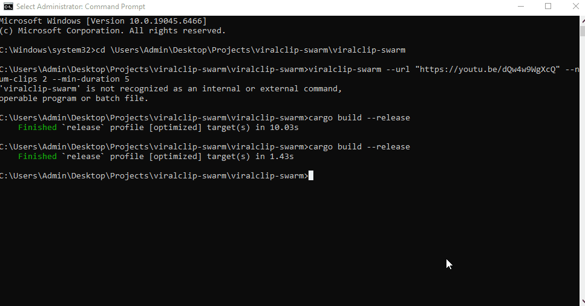

# ViralClip Swarm

Local-first Rust pipeline for turning long-form video into short-form clips, captions, vertical exports, and platform-ready metadata.

[](https://www.rust-lang.org/)
[](LICENSE)
[](https://ffmpeg.org/)
[](https://github.com/yt-dlp/yt-dlp)
[](https://github.com/openai/whisper)

ViralClip Swarm ingests a local file or YouTube URL, scores candidate moments, cuts clips in parallel, burns captions, crops for vertical platforms, and generates publishing metadata. It is built for creators, editors, and engineers who want a scriptable clipping workflow instead of a manual timeline grind.

## Start Here

If you want the fastest proof that the project works end-to-end, run:

```powershell
cargo run -- --config ".\showcase-smoke.json"
```

That produces a reproducible evidence package in `output/showcase-smoke/` including:

- clipped video output
- thumbnail preview image
- `benchmark.json`
- `ai_storyboard.json`
- `export_bundle.json`
- `proof_report.md`

For a larger local demo on the bundled source video, use:

```powershell
cargo run -- --config ".\showcase-config.json"
```

## Highlights

- Local file or YouTube input
- Parallel clip extraction
- Audio-based moment detection
- Transcript-aware ranking with hook scoring
- Optional motion, laughter, and chat-velocity scoring
- Caption burn-in with customizable styling
- `legendary` subtitle preset for aggressive creator-style captions
- Word-level animated caption presets via ASS
- 9:16 crop with `center`, `subject`, or `face` mode
- Benchmark logging in `csv`, `json`, or `human` format
- Optional AI storyboard generation for titles, hooks, and captions
- Platform export bundle generation for Shorts, Reels, and TikTok
- JSON config file support for reproducible runs
- Built-in API mode for local job submission
- Built-in proof report generation for benchmark runs
- Styled thumbnail extraction and optional collage generation
- Local Whisper or OpenAI cloud transcription

## Evidence

The repo now contains a generated smoke showcase package under `output/showcase-smoke/`.

Use it to inspect:

- whether clips are actually produced
- whether export metadata matches the generated clip
- whether the proof report metrics match the run outputs
- whether the pipeline is reproducible from config

## Demo



## Why This Exists

Most clipping workflows are still fragmented:

- download or locate a video
- scrub the timeline manually
- guess which moments will hit
- caption everything in another tool
- crop again for Shorts/Reels/TikTok
- write titles and social copy separately

ViralClip Swarm compresses that workflow into one pipeline.

## How It Works

1. Load a local video or download from YouTube with `yt-dlp`
2. Extract 16 kHz mono audio with FFmpeg
3. Score 1-second windows using audio energy
4. Optionally blend in transcript density, hook signals, motion, laughter, and chat signals
5. Select top-ranked windows with clip spacing
6. Extract clips in parallel
7. Optionally transcribe and burn subtitles
8. Optionally crop to vertical format
9. Write clips, logs, and optional AI metadata

## Requirements

- Rust
- FFmpeg with `ffprobe`
- `yt-dlp` for URL input
- One local transcription option:
  - Python + `openai-whisper`
  - `whisper` binary in `PATH`
- `curl` for cloud AI integrations

Cloud features additionally require:

- network access
- valid API credentials

## Install

```powershell
git clone https://github.com/Gangsworld3/viralclip-swarm.git
cd viralclip-swarm
cargo build --release
```

Binary output:

- Windows: `target\release\viralclip-swarm.exe`
- Linux/macOS: `target/release/viralclip-swarm`

## Quick Start

### Interactive Wizard

Running with no arguments launches an interactive setup flow:

```powershell
cargo run --
```

The wizard can configure:

- source input
- clip count and duration
- captions
- subtitle preset
- local vs cloud transcription
- crop, motion, laughter, chat log
- optional AI storyboard generation

### Local File

```powershell
cargo run -- --input "C:\path\to\video.mp4"
```

### YouTube URL

```powershell
cargo run -- --url "https://www.youtube.com/watch?v=..."
```

### Creator-Style Captions

```powershell
cargo run -- --input "C:\path\video.mp4" --captions --subtitle-preset legendary --subtitle-animation emphasis --subtitles-mode auto
```

### Shorts / Reels / TikTok Crop

```powershell
cargo run -- --input "C:\path\video.mp4" --crop --crop-mode face --num-clips 5 --min-duration 8
```

### AI Storyboard

```powershell
cargo run -- --input "C:\path\video.mp4" --llm-enable --llm-provider heuristic
```

### Config-Driven Run

```powershell
cargo run -- --config ".\showcase-config.json"
```

### API Mode

```powershell
cargo run -- --api --api-bind "127.0.0.1:8787"
```

Then submit a job:

```powershell
curl -X POST http://127.0.0.1:8787/run ^
  -H "Content-Type: application/json" ^
  -d "{\"input\":\"C:\\path\\video.mp4\",\"num_clips\":4,\"captions\":true}"
```

## Feature Areas

### Source Input

Exactly one source is required:

- `--input <PATH>`
- `--url <URL>`

### Scoring

Core scoring is based on audio energy. You can optionally enrich it with:

- motion / scene changes
- laughter-like audio modulation
- chat log timestamp density

Relevant flags:

- `--motion`
- `--scene-threshold <FLOAT>`
- `--laughter`
- `--chat-log <PATH>`
- `--energy-weight <FLOAT>`
- `--motion-weight <FLOAT>`
- `--laughter-weight <FLOAT>`
- `--chat-weight <FLOAT>`
- `--transcript-weight <FLOAT>`
- `--hook-weight <FLOAT>`

### Captions and Subtitle Styling

Enable captions with:

- `--captions`

Transcription options:

- `--transcription-provider <local|openai>`
- `--whisper-mode <python|binary>`
- `--whisper-model <tiny|base|small|medium|large>`
- `--cloud-transcription-model <MODEL>`
- `--transcription-api-key-env <ENV_VAR>`

Burn-in options:

- `--subtitles-mode <auto|ass|subtitles>`
- `--subtitle-preset <classic|legendary>`
- `--subtitle-font <FONT>`
- `--subtitle-size <PX>`
- `--subtitle-color <ASS_HEX>`
- `--subtitle-highlight-color <ASS_HEX>`
- `--subtitle-outline-color <ASS_HEX>`
- `--subtitle-back-color <ASS_HEX>`
- `--subtitle-outline <PX>`
- `--subtitle-shadow <PX>`
- `--subtitle-border-style <1|3>`
- `--subtitle-bold`
- `--subtitle-alignment <N>`
- `--subtitle-margin-v <PX>`
- `--subtitle-style-map <JSON_PATH>`
- `--subtitle-animation <none|karaoke|emphasis|impact|pulse>`

When subtitle animation is enabled, the pipeline uses the ASS rendering path automatically so word-level emphasis can be burned into the clip.

### `legendary` Subtitle Preset

`legendary` is built for loud, short-form creator edits:

- heavier font
- larger size
- stronger outline
- darker background plate
- bottom-centered placement
- more aggressive readability styling

You can still override any field manually after selecting the preset.

| Preset | Look | Best For | Default Behavior |
|---|---|---|---|
| `classic` | Clean, conventional subtitles | General readability, longer-form content, low-friction exports | Monospace-style defaults, lighter outline, standard subtitle treatment |
| `legendary` | Aggressive creator-style captions | Shorts, Reels, TikTok, punchy highlight edits | Heavier font, larger size, stronger outline, darker plate, tighter bottom placement |

### Cropping

- `--crop`
- `--crop-mode <center|subject|face>`

Use `face` when you want the crop logic to center on detected faces.
Use `subject` when you want face-first crop targeting with fallback to the most active region.

### Benchmarks

- `--csv-path <PATH>`
- `--csv-format <csv|json|human>`
- `--append`
- `--timestamp-mode <utc|local>`

### AI / LLM Metadata

Enable AI metadata output with:

- `--llm-enable`

Providers:

- `heuristic`
- `local`
- `openai`
- `anthropic`
- `gemini`

Relevant flags:

- `--llm-provider <PROVIDER>`
- `--llm-model <MODEL>`
- `--llm-api-key-env <ENV_VAR>`
- `--llm-output <PATH>`

### Export Bundles

Enable platform metadata bundle output with:

- `--export-bundle`
- `--export-bundle-path <PATH>`

Bundle output includes per-clip variants for:

- YouTube Shorts
- TikTok
- Instagram Reels

The AI storyboard contains per-clip:

- title
- hook
- social caption
- subtitle preset
- thumbnail text
- call to action
- YouTube Shorts caption
- TikTok caption
- Instagram Reels caption

If a cloud provider fails, the tool falls back to the heuristic generator.

## Example Commands

### Fast Local Run

```powershell
cargo run -- --input "C:\clips\podcast.mp4" --num-clips 6 --min-duration 10
```

### YouTube + Captions + Vertical Crop

```powershell
cargo run -- --url "https://www.youtube.com/watch?v=..." --captions --subtitle-preset legendary --crop --crop-mode face
```

### Local Whisper

```powershell
cargo run -- --input "C:\clips\stream.mp4" --captions --transcription-provider local --whisper-mode python --whisper-model base
```

### OpenAI Transcription + OpenAI Metadata

```powershell
cargo run -- --input "C:\clips\stream.mp4" --captions --transcription-provider openai --cloud-transcription-model whisper-1 --llm-enable --llm-provider openai --llm-model gpt-4o-mini
```

### Chat-Weighted Highlight Picking

```powershell
cargo run -- --input "C:\clips\stream.mp4" --chat-log ".\chat.txt" --chat-weight 1.25 --motion --laughter
```

## Subtitle Style Map

`--subtitle-style-map` accepts JSON keyed by clip id.

Example:

```json
{
  "0": {
    "font": "Arial Black",
    "size": 34,
    "color": "&H0000F6FF",
    "outline_color": "&H00000000",
    "back_color": "&H96000000",
    "outline": 4,
    "shadow": 1,
    "border_style": 3,
    "bold": true,
    "alignment": 2,
    "margin_v": 42
  },
  "2": {
    "color": "&H0000FFFF",
    "size": 38
  }
}
```

Clip id `0` acts as the default style for all clips unless a specific clip id overrides it.

## Output Layout

By default, the tool writes:

- clips to `./output/clip_*.mp4`
- benchmark logs to `./output/benchmark.csv`
- optional AI storyboard output to `./output/ai_storyboard.json`
- optional export bundle output to `./output/export_bundle.json`
- optional proof report output to `./output/proof_report.md`
- optional thumbnail previews to `./output/thumbnails/clip_*.jpg`

## Config File

`--config` accepts a JSON file using the CLI field names in `snake_case`.

Example:

```json
{
  "input": "C:\\clips\\podcast.mp4",
  "num_clips": 6,
  "min_duration": 12,
  "captions": true,
  "subtitle_preset": "legendary",
  "motion": true,
  "llm_enable": true,
  "llm_provider": "heuristic",
  "export_bundle": true
}
```

## API Endpoints

- `GET /health`
- `POST /run`
- `GET /jobs`
- `GET /jobs/{id}`

`POST /run` queues a job using the same JSON shape as `--config`.

If the environment variable named by `--api-key-env` is set, requests must include `x-api-key`.

## Proof Layer

Enable a markdown proof report for any run with:

- `--proof-report`
- `--proof-report-path <PATH>`

By default it writes `./output/proof_report.md` and summarizes:

- clip success rate
- average quality and readability metrics
- average processing latency
- best clip from the run
- clip-by-clip evidence table

## Thumbnails

Enable preview frame extraction with:

- `--thumbnails`
- `--thumbnails-dir <PATH>`
- `--thumbnail-style <plain|framed|cinematic>`
- `--thumbnail-collage`
- `--thumbnail-collage-path <PATH>`

By default it writes still previews to `./output/thumbnails/clip_*.jpg` and can also generate a collage image.

## Roadmap

- Add provider-specific cloud adapters beyond the current baseline request flow, with clearer retry and error handling.
- Add stronger transcript-aware ranking based on semantic structure rather than only lightweight heuristics.
- Add richer subtitle animation presets beyond the current `karaoke` and `emphasis` modes.
- Add better evaluation datasets and comparison reports on larger, more realistic source material.
- Add more test coverage around cloud transcription, API mode, wizard flows, subtitle presets, and AI storyboard parsing.

## Development

Run tests:

```powershell
cargo test
```

Run in debug:

```powershell
cargo run -- --input "C:\path\video.mp4"
```

## Operational Notes

- URL input requires `yt-dlp`
- FFmpeg is required for extraction, crop, and subtitle burn-in
- Cloud AI features require outbound network access
- Cloud providers are integrated in code, but availability depends on your environment and credentials

## License

MIT
